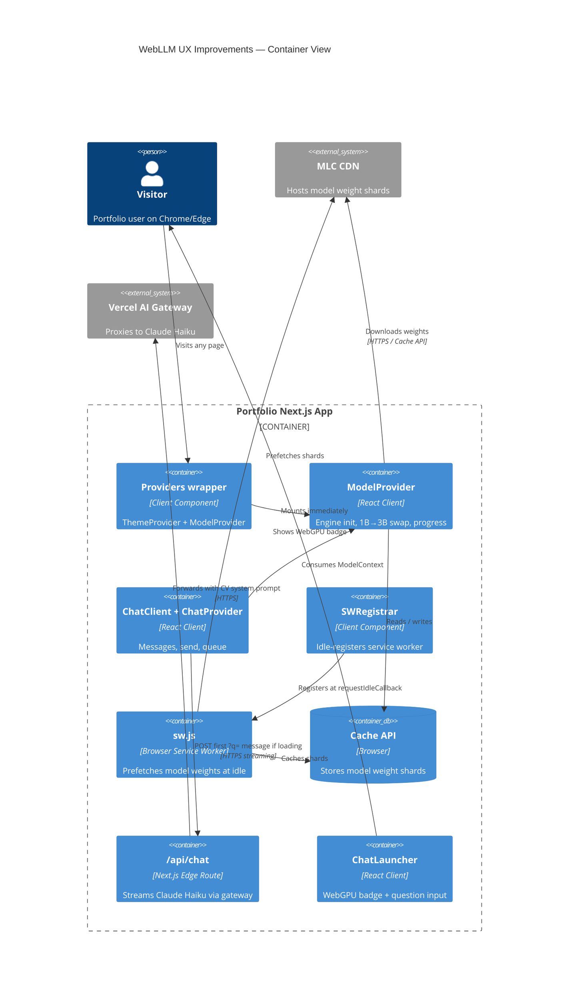

# Design: webllm-ux-improvements

## Context

Current state: `WebLLMProvider` is a monolithic client component mounted only on `app/chat/page.tsx`. Engine init, message history, and streaming all live inside one context. First-visit load takes 30–60 s with no ability to type during load, no warming of cached weights between sessions, and no fallback for the wait.

This change lifts engine lifecycle to layout level, adds SW cache warming, unlocks typing during load, enriches progress display, adds resume highlights while loading, implements a 1B → 3B two-stage boot, and introduces a Vercel AI Gateway edge route for instant homepage-handoff responses.

## Goals / Non-Goals

**Goals**
- Engine starts on any page visit (layout-level)
- Second-visit chat loads in ~5–10 s via SW-cached weights
- Visitor can type and queue a message while model loads
- Progress label shows engine-provided text (e.g. `"Loading weights 45/112"`)
- Resume highlights fill the thread during first-visit load
- First question answered by 1B model; 3B takes over transparently
- `?q=` handoff question answered instantly via Vercel AI Gateway edge route

**Non-Goals**
- Persistent chat history across sessions
- Multi-model user selection
- Server-side rendering of chat responses
- Caching API responses

## Project Facts Preflight

- **Dependencies checked:** `package.json` confirms `@mlc-ai/web-llm@^0.2.84`, `next@16.2.7`, `react@19.2.4`. No `ai` SDK or `@ai-sdk/*` installed — must add.
- **1B model availability:** `@mlc-ai/web-llm` v0.2.84 supports `Llama-3.2-1B-Instruct-q4f16_1-MLC` in the MLC preset list. Verify at runtime with `prebuiltAppConfig.model_list`.
- **Icon/export availability:** N/A — no new icons required.
- **Design tokens/classes checked:** `--color-accent`, `--color-surface`, `--color-surface-alt`, `--color-secondary`, `rounded-card` (`radius-card: 12px`), `font-mono`. Loading content cards must follow the same card radius rules.
- **Existing components checked:**
  - `components/chat/WebLLMProvider.tsx` — current monolith; to be split into `ModelProvider` + `ChatProvider`
  - `components/chat/ChatClient.tsx` — client island; wraps `WebLLMProvider` today
  - `components/chat/ChatInput.tsx` — `disabled` prop controls send; needs queue-mode support
  - `components/home/ChatLauncher.tsx` — no WebGPU detection today; add badge
  - `app/layout.tsx` — Server Component; can wrap children in a client `<Providers>` component
  - `app/api/` — does not exist; create for edge route
- **Scripts checked:** `npm run typecheck`, `npm run lint`, `npm run test`, `npm run build` — all referenced in tasks.

## Architecture

## Decisions

### D1 — Provider split: ModelProvider at layout, ChatProvider at chat

**Decision:** Split `WebLLMProvider` into two:
- `ModelProvider` (`"use client"`) — owns engine ref, `modelState`, `progress`, `progressText`. Mounted inside a new `<Providers>` wrapper in `app/layout.tsx`.
- `ChatProvider` (`"use client"`) — owns `messages`, `send`, `pendingQueue`. Mounted inside `components/chat/ChatClient.tsx`. Reads `ModelProvider` context for engine access.

**Why not keep one provider at layout:** Mounting full message/send state at layout level pollutes every page with chat state. Separation of concerns keeps layout-level context minimal.

**Alternative considered:** Lazy-initialise engine from chat page using a singleton module variable. Rejected: React context is the idiomatic pattern and gives proper re-render signalling across navigations.

**Layout constraint:** `app/layout.tsx` is a Server Component. Add a `components/providers/Providers.tsx` client wrapper (`"use client"`) that composes `ThemeProvider` and `ModelProvider`. Replace `<ThemeProvider>` in layout with `<Providers>`.

### D2 — Two-stage model: 1B then 3B

**Decision:** `ModelProvider` boots `Llama-3.2-1B-Instruct-q4f16_1-MLC` first. Once ready, it answers the first question while immediately starting `CreateMLCEngine` for `Llama-3.2-3B-Instruct-q4f16_1-MLC`. After the first reply completes, `engineRef` is swapped to the 3B engine (or 3B is used directly if it loads before the first question is sent).

**Why 1B first:** ~1 GB vs ~2.1 GB means first engine ready ~2× faster. Users see a response sooner.

**Risk — quality dip on first answer:** 1B model is noticeably weaker. Mitigated by: the first answer is also the API fallback answer (item D4), so the 1B response is actually a fallback-of-fallback only when API is unavailable.

**Implementation detail:** Two engine ref slots: `engine1BRef` and `engine3BRef`. `activeEngineRef` points to whichever is ready. Swap after 3B loads.

### D3 — Type-during-load queue

**Decision:** `ChatProvider` holds a `pendingQueue: string | null` ref. `ChatInput` is enabled during `modelState === "loading"` when no message is queued. `send()` checks:
1. If engine ready → normal completion.
2. If engine loading → store in `pendingQueue`, show "waiting for model…" indicator.

In `ModelProvider`, when `modelState` transitions to `"ready"`, fire an `onReady` callback consumed by `ChatProvider` to flush the queue.

**Alternative considered:** Pass queue through context. Rejected: adds unnecessary re-renders. A ref + callback pattern (per `rerender-use-ref-transient-values` guideline) is more efficient.

### D4 — API fallback via Vercel AI Gateway

**Decision:** When chat page mounts with `?q=<question>` AND `modelState` is `loading`, immediately POST to `/api/chat` edge route. The route uses Vercel AI SDK + Anthropic provider via Vercel AI Gateway to stream a Claude Haiku response. On success, the streamed reply appears in the thread. Subsequent messages wait for the local engine.

**Package to add:** `ai` (Vercel AI SDK only — no `@ai-sdk/anthropic` needed). Vercel AI Gateway is accessed via `AI_GATEWAY_API_KEY` env var; the model string uses the `provider/model` prefix format (e.g. `'anthropic/claude-haiku-4-5-20251001'`). `streamText({ model: 'anthropic/claude-haiku-4-5-20251001', ... })` routes through the gateway automatically when `AI_GATEWAY_API_KEY` is set. Ref: https://vercel.com/docs/ai-gateway/getting-started/text

**Why only for `?q=` handoff:** Direct `/chat` visits have no pre-formed question; the visitor hasn't expressed intent yet. Making a blank API call wastes tokens. Scoping to the handoff path means exactly one API call per homepage-originated session.

**Silent failure:** If the edge route fails (network error, 5xx), the client ignores the error and falls back to normal queue-and-wait flow. No error shown.

**Cost guard:** Only one API call per session (queued on arrival, cleared once sent). No per-turn API cost.

### D5 — Service Worker cache warming

**Decision:** `public/sw.js` is a hand-written service worker (no Workbox, keeps bundle small). `SWRegistrar` (`"use client"`) mounts in layout and calls `navigator.serviceWorker.register('/sw.js')` inside `requestIdleCallback`. On install, the SW fetches a manifest of model weight shard URLs and stores them in `caches.open('mlc-weights-v1')`. The fetch is a background idle task — it yields to user input via `waitUntil(installWeights())` where `installWeights` batches fetches 2 at a time.

**Why idle time:** WebLLM loads weights from Cache API by default. Pre-populating the cache before the user navigates to `/chat` means the engine skips the network entirely on second visit.

**Cache version key:** `mlc-weights-v1`. On SW update, old cache is deleted in the `activate` event.

**Weight manifest:** Hardcode the weight shard URLs for `Llama-3.2-3B-Instruct-q4f16_1-MLC` from the MLC CDN. These are stable between model versions.

### D6 — WebGPU badge on ChatLauncher

**Decision:** `ChatLauncher` adds a `useEffect` that runs after hydration to detect `(navigator as Navigator & { gpu?: unknown }).gpu`. Sets `gpuSupported: boolean | null` (null = not yet checked). Renders:
- `null` — no badge (pre-hydration, avoids mismatch)
- `true` — accent-coloured badge "Works in your browser"
- `false` — muted/warning badge "Requires Chrome or Edge 113+"

Per `rendering-hydration-no-flicker` guideline: state starts `null` (no badge rendered server-side), set to `true/false` after mount. No `suppressHydrationWarning` needed since nothing is rendered until client.

### D7 — Loading content (resume highlights in thread)

**Decision:** `ChatClient` receives new props `loadingContent: { currentRole: string; latestProject: string; topSkills: string }` from `app/chat/page.tsx` (build-time SSG data). A new component `ChatLoadingContent` renders three content cards inside the thread when `chatState === "loading"`. Cards are removed when state transitions to `ready` or first assistant message arrives.

**Data sources:** `content/experience.json` (bullets[0] of most recent entry), `content/projects.json` (first project name + tagline), `content/skills.json` (first SkillCategory skills as comma-separated string). All read at build time.

### D8 — Richer progress text

**Decision:** Extend `progress` in `ModelProvider` context from `number` to `{ pct: number; text: string }`. Change `initProgressCallback` handler to capture `report.text` alongside `Math.round(report.progress * 100)`. Pass `progressText` to `ChatClient` for display alongside the progress bar. No design token changes — text uses `text-secondary text-sm font-mono`.

## Risks / Trade-offs

- [Two-stage model increases complexity] → Keep `engine1BRef`/`engine3BRef` private to `ModelProvider`; expose only `activeEngine` to `ChatProvider`. Integration test with both engines.
- [API fallback leaks CV data to a third-party] → Already accepted: CV content is public on the site. System prompt is the same build-time context string.
- [SW cache version drift] → Hardcode weight URLs per model version; bump `mlc-weights-v1` key when model changes. Accept stale cache until SW updates.
- [Layout-level ModelProvider starts engine on every page] → Engine init is gated on `hasWebGPU`; on unsupported browsers or server render, no engine starts. On supported browsers the background download is desirable.
- [Vercel AI Gateway requires env var] → Gate the API route: return 503 if `AI_GATEWAY_API_KEY` is absent. Client treats 503 same as any other fallback error.

## Migration Plan

1. Add `ai` and `@ai-sdk/anthropic` packages.
2. Create `Providers` wrapper; update layout to use it.
3. Create `ModelProvider` (engine lifecycle only).
4. Refactor `WebLLMProvider` → `ChatProvider` (messages, send, queue).
5. Update `ChatClient` to consume `ModelProvider` + `ChatProvider`.
6. Add `SWRegistrar` to `Providers`; write `public/sw.js`.
7. Add `/api/chat` edge route with Vercel AI SDK.
8. Update `ChatLauncher` with WebGPU badge.
9. Update `ChatInput` to allow send during loading.
10. Add `ChatLoadingContent` component.
11. Wire richer progress text through context.

**Rollback:** All changes are isolated to chat components and layout wrapper. Reverting `Providers` to `ThemeProvider` restores the pre-change state. The edge route can be disabled by removing `ANTHROPIC_API_KEY` env var.

## Open Questions

- Vercel AI Gateway confirmed: `streamText({ model: 'anthropic/claude-haiku-4-5-20251001', ... })` with `AI_GATEWAY_API_KEY` env var. No `@ai-sdk/anthropic` package needed. Install only `ai`.
- MLC CDN weight shard URL list for `Llama-3.2-3B` — extract from `@mlc-ai/web-llm` `prebuiltAppConfig` at implementation time rather than hardcoding.
- Whether `@mlc-ai/web-llm@0.2.84` exposes `progressCallback.text` field — verify against the package type definitions before using.
